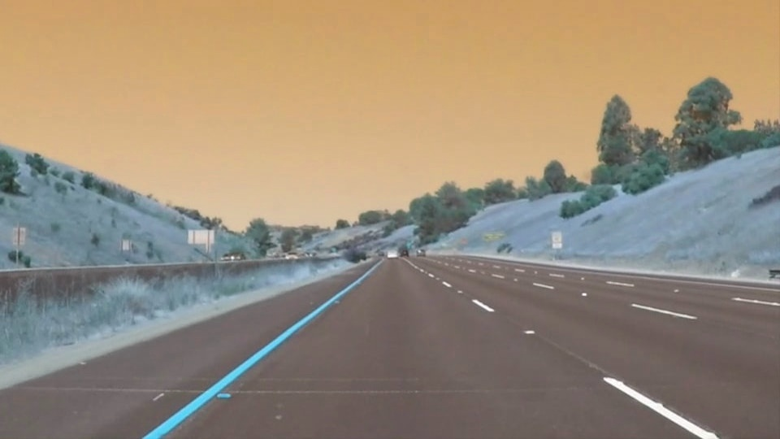
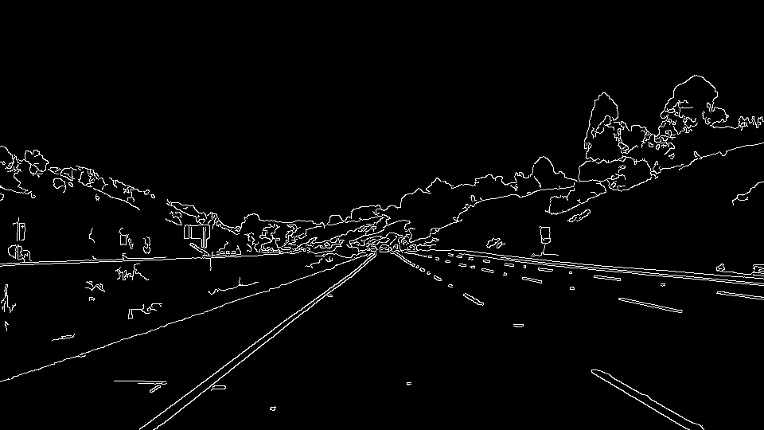
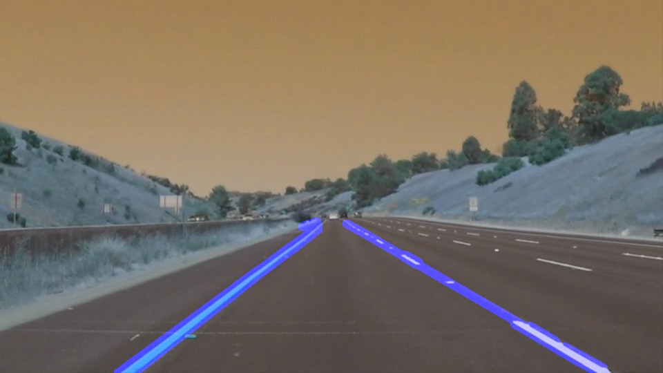

# **Finding Lane Lines on the Road** 

---

**Overview**

In this project, computer vision tools (OpenCV functions) are used to identify lane lines on the road. Pipeline on a series of individual images are developed, then this pipeline is used to image transformation. Finally, result is seen on video stream.

Example image from highway can be seen as following:

---

### Reflection

### 1. Describe your pipeline. As part of the description, explain how you modified the draw_lines() function.

My pipeline consisted of 5 steps. 

1) I converted the images to grayscale
2) I converted gray image to gaussian smoothing / blurring
Parameter:
- kernel_size = 5 #Kernel size is selected as 5.
3) I used Canny Edge Detector to find edges by using Canny Algorithm.
Parameters: 
- low_threshold = 50
- high_threshold = 150
4) I create the region of interest
5) I used hough transformation
Parameters:
- rho = 1 # distance resolution in pixels of the Hough grid
- theta = np.pi/180 # angular resolution in radians of the Hough grid
- threshold = 22     # minimum number of votes (intersections in Hough grid cell)
- min_line_len = 18 #minimum number of pixels making up a line
- max_line_gap = 1    # maximum gap in pixels between connectable line segments
Transformation can be seen as:

### 2. Identify potential shortcomings with your current pipeline

If there is sunshine or cross of light, I suppose that  my pipeline can not find lane lines exactly since in the grayscale model, canny detection can find too many useless edges and after hough transformation, real lines can not be divided from the noise edges. It causes serious safety issue.

I suppose that parameters I used in this pipeline can only work for one type of environment such as straigh lane lines under normal environment condition.

Pipeline that I raised cost too much time, which can be incompatable for real application.

### 3. Suggest possible improvements to your pipeline

A possible improvement would be to generelize parameters to fit all type of environment condition and to find a more efficient and robust way to detect lane lines. For example, in order to find whiter and yellow efficiently, color space can be used.

Feature based methods such as CNNs would be better to use.
